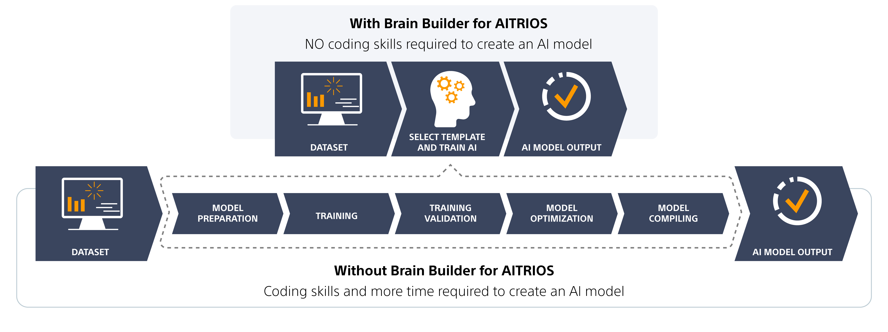

# AITRIOS

!!!! cost license !!!!


https://developer.aitrios.sony-semicon.com/en/studio/brain-builder#downloads

Brain Builder for AITRIOS walks you through the necessary steps to efficiently label, train, and deploy custom AI models for the Raspberry Pi AI Camera 





## free examples

https://developer.aitrios.sony-semicon.com/en/raspberrypi-ai-camera/develop/use-cases#smart-facility


```
from:
     https://github.com/SonySemiconductorSolutions/aitrios-rpi-sample-apps/tree/main

    Highvis - Uses a Custom trained Nanodet Model
    Line Monitoring - Uses a Custom Classification Model
    Parking Monitoring - Uses Nanodet with postprocessing included
    Queue Monitoring - Uses Nanodet with postprocessing included
    Workout Monitoring - Uses HigherhrNet, pose estimation
```

* see [examples](./examples.md)


## deploy:
* see [deploy](../packDemo1/readme.md)