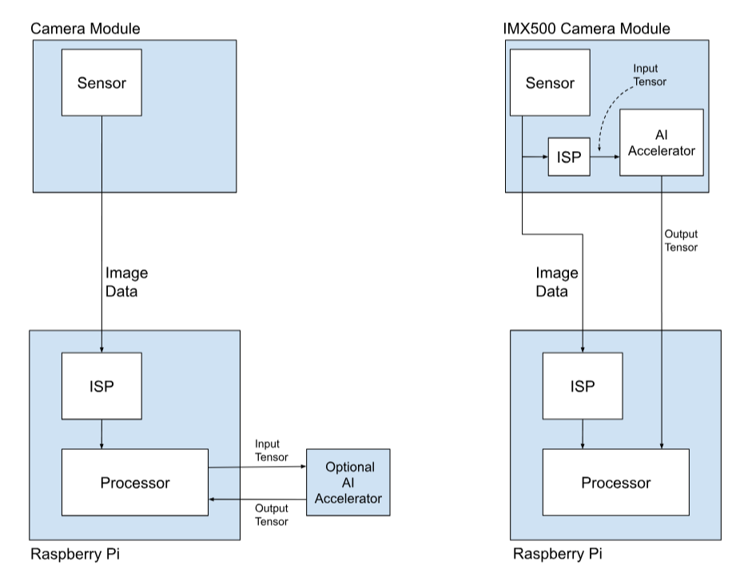
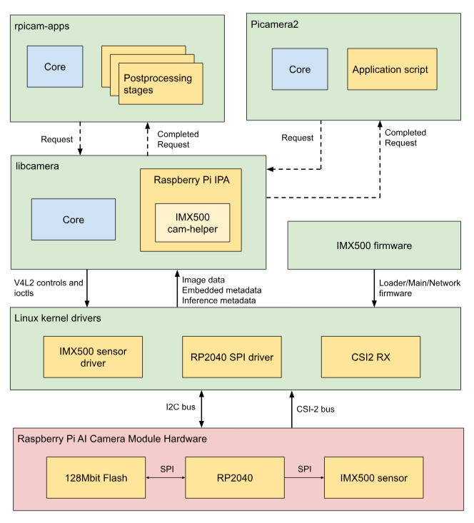

# system architecture

## overview

The camera module sends this tensor directly into the AI accelerator within the camera, which produces output tensors that contain the inferencing results.

Input Tensor 
* Produced by a small on-board ISP which also crops and scales the camera image to the dimensions expected by the neural network that has been loaded. 
* The input tensor is not normally made available to applications, though it is possible to access it for debugging purposes

Region of Interest (ROI)
* Specifies exactly which part of the sensor image is cropped out before being rescaled to the size demanded by the neural network.
* Can be queried and set by an application. 
* The units used are always pixels in the full resolution sensor output. The default ROI setting uses the full image received from the sensor, cropping no data.

Output Tensors
* The results of inferencing performed by the neural network

