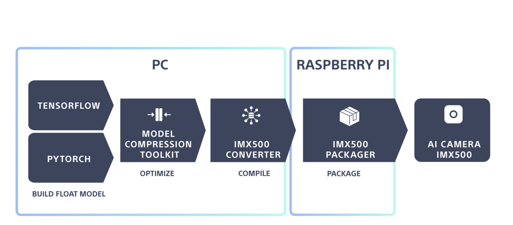
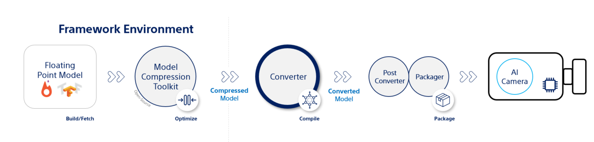

# deploy:





## stage1: train
will begin with a MobileNetV2 machine learning model pre-trained to perform Image Classification.

* tools : python, tensorflow


## stage2 : optimize
Optimize with MCT
use the Model Compression Toolkit (MCT), an open-source Python package from Sony
 designed to optimize neural network models for constrained hardware ; will generate a quantized model .

* tools: "model_compression_toolkit as mct"
* see [train lab](./01_training_quantization.ipynb)
* output: qmodel.onnx

## stage3 :  compile
use the IMX500 Converter to transform the model from its original framework format into binary files - will contain data and hardware configurations ready for packaging and deployment on the IMX500 chip.

install:
```bash
pip install imx500-converter[tf]        // for tensorflow
pip install imx500-converter[pt]        // for pytorch
```

run:
```bash
imxconv-tf -i <MODEL PATH> -o <CONVERTER OUTPUT PATH>   // for tensorflow
imxconv-pt -i <MODEL PATH> -o <CONVERTER OUTPUT PATH>   // for pytorch
```

The converted model will be saved as a .zip ; Transfer this .zip file to your Raspberry Pi to proceed with the deployment.

## stage4: pack

the package tool is install with all the tools on the pi by 
sudo apt install imx500-tools 

```
imx500-package.sh -i <CONVERTER OUTPUT PATH> -o <RPK OUTPUT PATH> -f <INPUT FORMAT JSON PATH>
```
This process will generate a network.rpk file, which is the deployable package for the AI camera.


## stage5: run

```bash
git clone https://github.com/raspberrypi/picamera2.git
cd picamera2/examples/imx500
python imx500_classification_demo.py --model <RPK OUTPUT PATH>/network.rpk --preserve-aspect-ratio
```