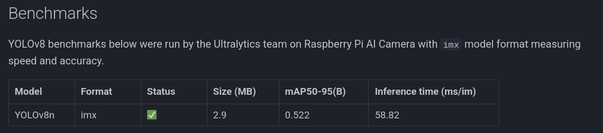

# run




```

git clone https://github.com/raspberrypi/picamera2
cd picamera2
pip install -e .  --break-system-packages
cd examples/imx500


 python imx500_object_detection_demo.py --model /home/user/packDemo2/network.rpk  --fps 17 --bbox-normalization --ignore-dash-labels --bbox-order xy --labels labels.txt


```