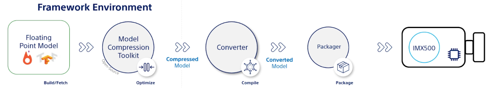

# about

* based on https://docs.ultralytics.com/integrations/sony-imx500/

## option 1
* [noteboox0](./00_model.ipynb) from pt to onxx and then like before

## option2
* [notebook1](./01_export.ipynb) - use ultralytics export to format imx !!!
* produce packerOut.zip directly - skipping 2convert stage
* then just pack on chroot env to get network.rpk;